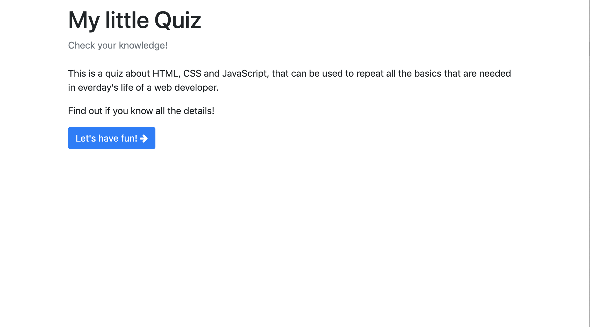
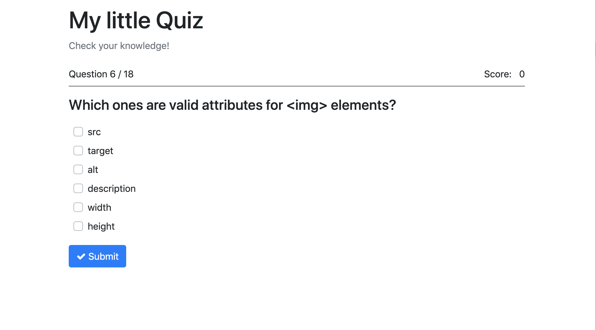
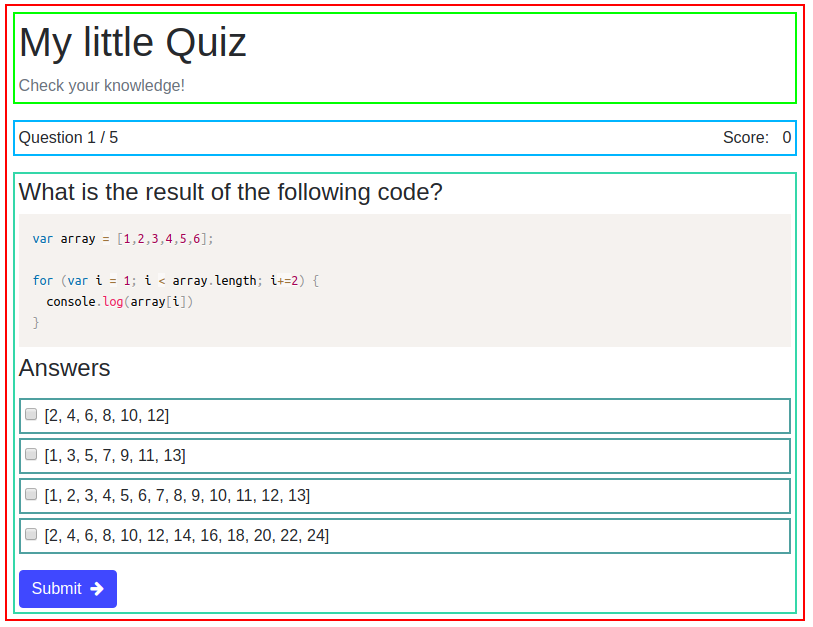

## Anweisungen für Schüler:

### Ein Quiz erstellen

- Erstelle ein Quiz mit React.
- Du solltest die Datei **questions.js** mit Fragen und Antworten für das Quiz verwenden und sie in die entsprechende Datei importieren.
- Sobald der Nutzer die Antwort markiert und auf Absenden klickt, sollte er die richtige Antwort grün und die falsche Antwort rot markiert sehen.
- Der/die Nutzer/in klickt bis zum Ende des Quiz auf die nächste Frage. Wenn der/die Nutzer/in keine Antwort anklickt, erinnere ihn/sie daran, eine auszuwählen.
- Aktualisiere den Punktestand nach jeder Antwort.
- Zeige den Punktestand jederzeit an.
- Das Quizergebnis sollte die beantworteten Fragen, die richtigen Antworten, die falschen Antworten und die Möglichkeit, das Quiz neu zu starten, anzeigen.

- Starte das Projekt mit Create React App.

- Dein Quiz sollte die folgenden Komponenten enthalten: _App, Home, Error404, StatusBar, Question, Answer, Result._

- Verwende den React Router.

- Verwende Lifecycle-Methoden.

- Siehe Bilder als Referenz:
    
    
    

**Bonus**

- Erstelle deine eigenen Fragen und Antworten
- Erhöhe die Anzahl der Fragen.

### Regeln

- Dies ist eine individuelle Aufgabe.
- Deadline: 2 Tage.
- Verwende **Git richtig**
- Dokumentiere deinen Code mit Kommentaren.
